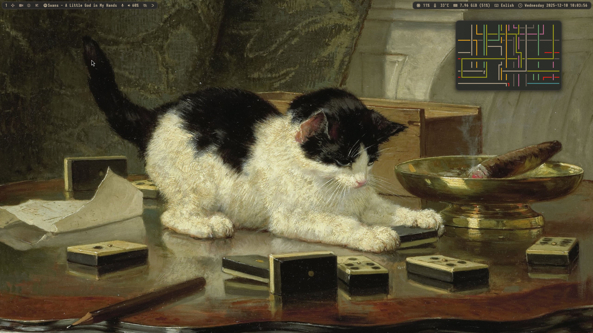

# My Hyprland Dotfiles

A personalized and aesthetic setup for Hyprland, designed for a smooth and productive workflow.



## About this Setup

This repository contains my personal dotfiles for Hyprland, a dynamic tiling Wayland compositor. The setup is designed to be both visually appealing and highly functional, with a focus on minimalism and ease of use. It uses `stow` to manage symlinks and `yay` for package management, assuming an Arch-based distribution.

## Configured Applications

This setup includes configurations for the following software:

*   **Window Manager**: [Hyprland](https://hyprland.org/)
*   **Status Bar**: [Waybar](https://github.com/Alexays/Waybar)
*   **Application Launcher**: [Rofi](https://github.com/davatorium/rofi)
*   **Terminal**: [Kitty](https://sw.kovidgoyal.net/kitty/)
*   **Notification Daemon**: [Mako](https://github.com/emersion/mako)
*   **GTK/Qt Theming**: GTK, Qt5/Qt6, Kvantum
*   **Screenshot Tool**: `grim`, `slurp`, and `swappy`
*   **PDF Viewer**: [Zathura](https://pwmt.org/projects/zathura/)
*   **Shell**: Zsh

## Dependencies

The `install.sh` script can install the following packages required for this specific desktop setup. Please note that this list excludes core system packages, drivers, and basic utilities.

### Environment and Session Components
- `hyprland`
- `hypridle`
- `hyprlock`
- `hyprpaper`
- `hyprpolkitagent`
- `waybar`
- `rofi`, `rofi-emoji`
- `mako`
- `ly`
- `xdg-desktop-portal-hyprland`
- `xdg-desktop-portal-gtk`

### GUI Applications
- `kitty`
- `thunar` (with plugins)
- `tumbler`
- `pavucontrol`
- `zathura` (with `zathura-pdf-poppler`)
- `xarchiver`

### Theming and Appearance
- `qt5ct`, `qt6ct`
- `kvantum`
- `nwg-look`
- `papirus-icon-theme`
- `noto-fonts`, `noto-fonts-emoji`
- `ttf-iosevka-nerd`

### Workflow Utilities
- `stow`
- `yay`
- `grim`, `slurp`, `swappy`
- `cliphist`
- `fastfetch`
- `ffmpegthumbnailer`

## Installation

This setup is intended for **Arch-based Linux distributions** with `yay` and `stow` installed.

1.  **Clone the repository:**
    ```bash
    git clone <your-repo-url>
    cd dotfiles
    ```

2.  **Run the installation script:**
    ```bash
    ./install.sh
    ```

The script will:
- Check for `stow` and `yay`.
- Warn you about any potential conflicts with existing configuration files.
- Symlink the dotfiles to your home directory using `stow`.
- Ask for confirmation to install all the essential packages listed above.

## Wallpaper

The wallpaper used in the preview is included in the repository.


